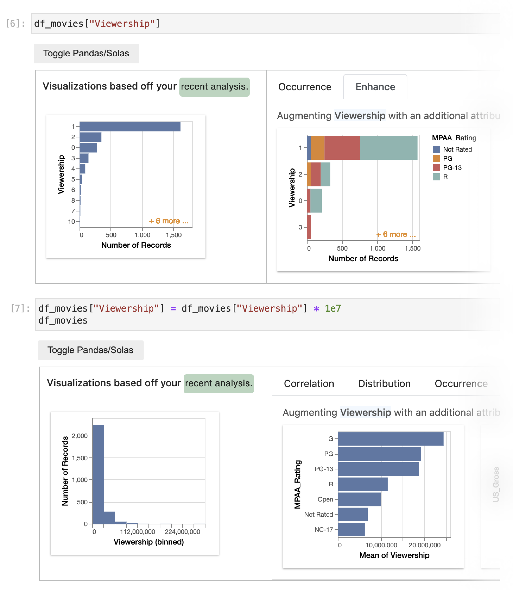

# Solas

Solas is a jupyter extension for visualization recommendation that uses your analysis history to provide better recommendations. You can write analysis code like you normally would in Pandas, Solas will visualize your data for you!

Learn more about Solar in our [reserach paper](https://willepperson.com/papers/Solas_EuroVis22.pdf). If you use Solas in your research project, please cite the paper as:

```bib
@inproceedings{epperson2022leveraging,
  title={Leveraging Analysis History for Improved In Situ Visualization Recommendation},
  author={Epperson, Will and Jung-Lin Lee, Doris and Wang, Leijie and Agarwal, Kunal and Parameswaran, Aditya G and Moritz, Dominik and Perer, Adam},
  booktitle={Computer Graphics Forum},
  year={2022}
}
```

## Task-specific visualizations
Solas tracks analysis commands issued through the Pandas API and automatically visualies the returned data. By tracking the history of analysis commands, Solas visualizes returned data in a sensible encoding.

For example, when `df.describe()` or `df.corr()` are called Solas visulizes these functions as a boxplot and heatmap, respectively.


## Model column interest

Solas also models your interest in each column of the data and uses this to show you relevant visualizations. Below, a user has most recently interacted with `Class` so it is shown at the top of the interface. Since they have also recently interacted with `Worldwide_Gross`, `MPAA_Rating`, and `Viewership`, they are shown in the enhance tab.


## Update types based on interaction

Solas is also able to do better type inference based on how you interact with your data. In the example below, `Viewership` is initially inferred as nominal using standard data-based type inference since it has low cardinality. Once the user applies a multiplication operation to the column, the type is updated to quantitative and is visualized accordingly.



## Easy install
Solas is a python library and jupyter extension. The python library can be downloaded from pip and the jupyter extension loaded through the extension manager.
```
pip install solas
jupyter labextension install @jupyter-widgets/jupyterlab-manager
jupyter labextension install solaswidget
```

Then you can run `import solas` in jupyter environments. Note this wont work outside of ipython envs.

## Contributing

For more information about installing for Development purposes and contributing see `CONTRIBUTING.md`
